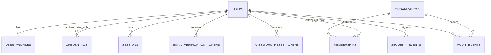

# Schéma de données initial

Le schéma exécutable proposé se trouve dans `convex/schema.ts`. Tous les identifiants sont des références Convex, les dates sont des timestamps UTC en millisecondes et les collections multi-tenant possèdent un index commençant par `organizationId` lorsque c’est le pattern d’accès.

## Relations

## Tables Phase 1

- `users` : e-mail canonique, état, type de compte, vérification et soft-delete.
- `userProfiles` : identité affichable séparée de l’identité d’authentification.
- `credentials` : hash de mot de passe versionné et date de rotation.
- `sessions` : hash du token de session, expiration, révocation, métadonnées minimales.
- `emailVerificationTokens` : hash, expiration, consommation et invalidation.
- `passwordResetTokens` : hash, expiration, consommation et invalidation.
- `organizations` : tenant racine.
- `memberships` : relation utilisateur/organisation, rôle et état.
- `invitations` : invitation hashée et expirante.
- `securityEvents` : signaux d’authentification/abus.
- `auditEvents` : journal métier append-only.
- `rateLimitBuckets` : compteurs par action et clé pseudonymisée.

## Invariants

- `users.normalizedEmail` est unique fonctionnellement, imposé par lookup indexé avant insertion.
- Un membership actif est unique par `(organizationId, userId)`.
- Un token n’est retrouvé que par son hash et n’est consommable qu’une fois.
- Les documents sensibles utilisent soft-delete ou révocation ; les audits ne sont pas modifiables.
- Les données d’un tenant ne sont jamais requêtées via un identifiant seul quand un contexte organisation est requis.

## Évolutions Phase 2

Ajout de `businesses`, `businessClaims`, `locations` et des résultats de registre. `businessClaims` séparera explicitement existence légale et contrôle administratif.
